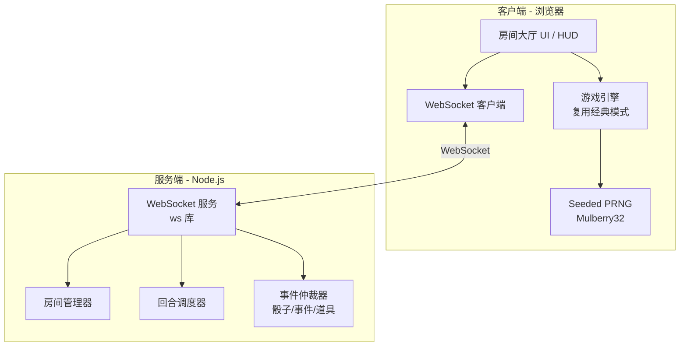
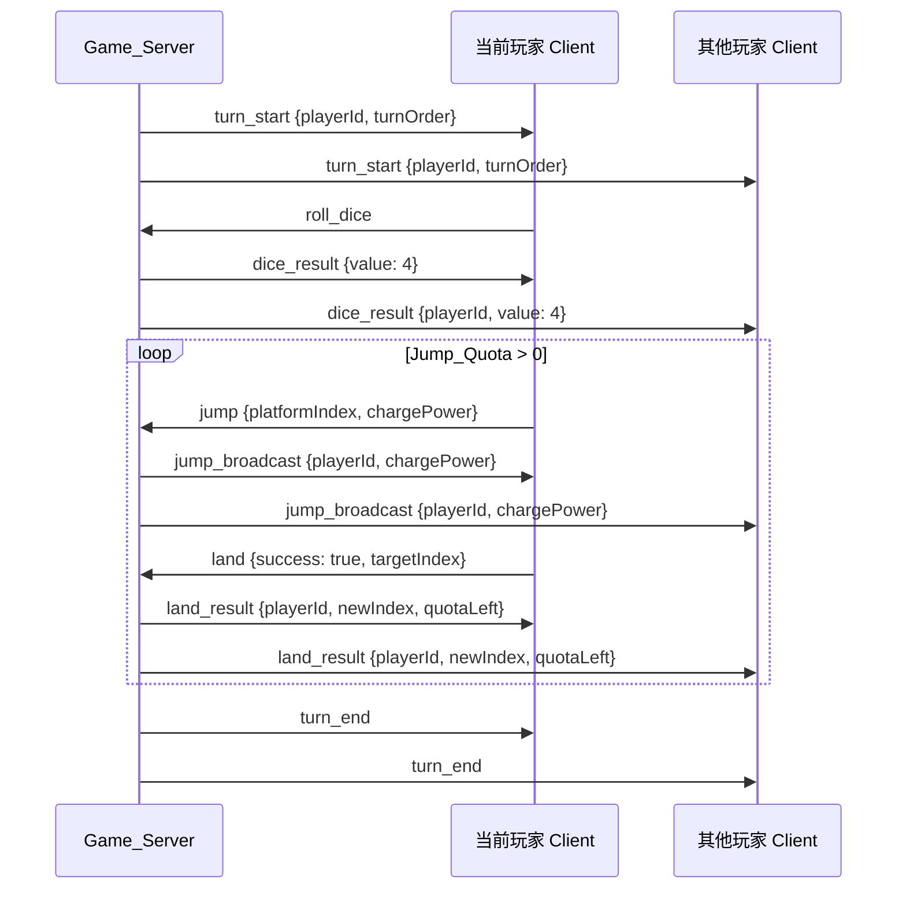

# 技术设计文档：竞技模式（回合制多人赛跑对战）

## 概述

竞技模式将现有的单人跳跃游戏扩展为回合制多人线上赛跑对战。核心架构变更包括：

1. 新增 Node.js + WebSocket 后端服务（Game_Server），负责房间管理、回合调度、状态仲裁
2. 前端从单一 `index.html` 拆分为模块化结构，复用经典模式的跳跃引擎，新增网络层、房间大厅 UI、竞技 HUD、道具系统等
3. 所有游戏关键状态（骰子结果、事件抽取、道具验证）由服务端权威决定，客户端负责渲染和输入采集

现有代码分析：
- 经典模式完全在 `index.html` 中实现（~1674 行），包含 `Platform`、`Player`、`Character`、`CharacterRoster` 类，`SHAPES` 形状系统，`SFX` 音效系统，粒子系统，以及完整的蓄力-跳跃-落地判定流程
- 平台生成使用 `Math.random()`，需替换为 seeded PRNG（Mulberry32）以实现确定性赛道
- 碰撞检测使用 `hitTest`（形状碰撞 + 4 脚点容错），可直接复用
- Canvas 2D 渲染，600×650 画布，等距投影风格

## 架构

### 整体架构图



### 通信流程（一个回合）



### 设计决策

| 决策 | 选择 | 理由 |
|------|------|------|
| 后端框架 | 原生 Node.js + ws 库 | 轻量，无需 Express 等框架，纯 WebSocket 通信 |
| 状态权威 | 服务端权威 | 骰子、事件、道具效果由服务端决定，防作弊 |
| 赛道同步 | 种子同步 + 客户端本地生成 | 减少网络传输，只需同步一个 32 位种子 |
| 前端架构 | 保持单 HTML 文件，新增 `server.js` | 最小化改动，竞技模式代码追加到现有文件 |
| PRNG 算法 | Mulberry32 | 简单高效，32 位种子，输出质量好，适合游戏场景 |

## 组件与接口

### 服务端组件

#### 1. WebSocket 服务 (`server.js`)

入口文件，启动 WebSocket 服务并路由消息。

```typescript
// 消息路由
interface ServerConfig {
  port: number;          // 默认 3000
  heartbeatTimeout: number; // 5000ms
  roomDestroyDelay: number; // 30000ms
}

// 消息处理入口
function handleMessage(ws: WebSocket, message: ClientMessage): void;
```

#### 2. 房间管理器 (`RoomManager`)

```typescript
class RoomManager {
  createRoom(hostId: string): Room;
  joinRoom(roomCode: string, playerId: string, playerName: string): Room | Error;
  removePlayer(playerId: string): void;
  getRoom(roomCode: string): Room | null;
  getRoomByPlayer(playerId: string): Room | null;
  destroyRoom(roomCode: string): void;
}
```

#### 3. 回合调度器 (`TurnScheduler`)

```typescript
class TurnScheduler {
  // 内嵌在 Room 中
  startGame(room: Room): void;
  rollDice(room: Room): number;           // 1-6，应用 Dice_Modifier
  reportJumpResult(room: Room, playerId: string, success: boolean): void;
  endTurn(room: Room): void;              // 自动轮转到下一位
  skipTurn(room: Room, playerId: string): void; // 处理 Skip_Turn
}
```

#### 4. 事件仲裁器 (`EventArbiter`)

```typescript
class EventArbiter {
  triggerMysteryPlatform(room: Room, playerId: string): MysteryResult;
  useItem(room: Room, playerId: string, itemType: ItemType, targetId?: string): ItemResult;
  applyEvent(room: Room, event: ArenaEvent): void;
}
```

### 客户端组件

#### 5. WebSocket 客户端 (`NetworkClient`)

```typescript
class NetworkClient {
  connect(url: string): Promise<void>;
  send(message: ClientMessage): void;
  onMessage(handler: (msg: ServerMessage) => void): void;
  startHeartbeat(): void;       // 每 2 秒
  reconnect(maxRetries: number): Promise<boolean>; // 最多 3 次，间隔 2 秒
  disconnect(): void;
}
```

#### 6. 房间大厅 UI (`RoomLobbyUI`)

管理创建/加入房间的界面交互，包括房间码显示、玩家列表、开始按钮。

#### 7. 竞技游戏控制器 (`ArenaGameController`)

协调竞技模式的游戏流程，桥接网络消息与游戏引擎。

```typescript
class ArenaGameController {
  // 状态
  localPlayerId: string;
  room: RoomState;
  racetrack: Platform[];       // 20 个平台
  playerStates: Map<string, ArenaPlayerState>;
  
  // 流程
  initRacetrack(seed: number): void;    // 用 Mulberry32 生成 20 平台
  onTurnStart(playerId: string): void;
  onDiceResult(value: number): void;
  onJumpBroadcast(playerId: string, chargePower: number): void;
  onLandResult(playerId: string, newIndex: number): void;
  onEventTriggered(event: ArenaEvent): void;
  onGameEnd(rankings: PlayerRanking[]): void;
}
```

#### 8. Seeded PRNG (`mulberry32`)

```typescript
function mulberry32(seed: number): () => number;
// 返回一个函数，每次调用产生 [0, 1) 的浮点数
```

#### 9. 竞技 HUD (`ArenaHUD`)

渲染赛道进度条、骰子信息、道具栏、回合信息、玩家状态卡片等。

#### 10. 道具系统 (`ItemSystem`)

客户端道具 UI 交互 + 服务端道具逻辑验证。

### WebSocket 消息协议

#### 客户端 → 服务端

```typescript
type ClientMessage =
  | { type: 'create_room'; playerName: string }
  | { type: 'join_room'; roomCode: string; playerName: string }
  | { type: 'start_game' }
  | { type: 'roll_dice' }
  | { type: 'jump'; platformIndex: number; chargePower: number }
  | { type: 'land'; success: boolean; targetIndex: number }
  | { type: 'trigger_mystery'; platformIndex: number }
  | { type: 'use_item'; itemType: ItemType; targetId?: string }
  | { type: 'heartbeat' }
  | { type: 'reconnect'; playerId: string; roomCode: string };
```

#### 服务端 → 客户端

```typescript
type ServerMessage =
  | { type: 'welcome'; playerId: string }
  | { type: 'room_created'; roomCode: string; room: RoomState }
  | { type: 'room_joined'; room: RoomState }
  | { type: 'room_error'; message: string }
  | { type: 'player_list_update'; players: PlayerInfo[] }
  | { type: 'game_start'; seed: number; turnOrder: string[] }
  | { type: 'turn_start'; playerId: string }
  | { type: 'dice_result'; playerId: string; value: number; modifier?: DiceModifier }
  | { type: 'jump_broadcast'; playerId: string; platformIndex: number; chargePower: number }
  | { type: 'land_result'; playerId: string; success: boolean; newIndex: number; quotaLeft: number }
  | { type: 'turn_end'; nextPlayerId: string }
  | { type: 'mystery_result'; playerId: string; resultType: 'event' | 'item'; event?: ArenaEvent; item?: ItemType }
  | { type: 'event_effect'; event: ArenaEvent; affectedPlayers: EventEffect[] }
  | { type: 'item_used'; playerId: string; itemType: ItemType; targetId?: string; effect: ItemEffect }
  | { type: 'player_disconnected'; playerId: string }
  | { type: 'player_reconnected'; playerId: string }
  | { type: 'host_changed'; newHostId: string }
  | { type: 'game_end'; winnerId: string; rankings: PlayerRanking[] }
  | { type: 'room_snapshot'; room: RoomState }
  | { type: 'skip_turn'; playerId: string; remainingSkips: number }
  | { type: 'error'; message: string };
```

## 数据模型

### 服务端数据模型

```typescript
interface Room {
  code: string;                    // 4 位房间码
  hostId: string;                  // 房主 ID
  players: Map<string, ServerPlayer>;
  phase: 'waiting' | 'playing' | 'ended';
  seed: number;                    // Platform_Seed (32 位整数)
  turnOrder: string[];             // 玩家 ID 数组，按加入顺序
  currentTurnIndex: number;        // 当前回合玩家在 turnOrder 中的索引
  currentTurnQuota: number;        // 当前回合剩余跳跃次数
  roundNumber: number;             // 当前回合总数
  traps: Map<number, string>;      // platformIndex -> 放置者 playerId
  lastEvents: Map<string, string>; // playerId -> 上次触发的事件名（防连续相同）
}

interface ServerPlayer {
  id: string;
  name: string;
  platformIndex: number;           // 1-20
  items: ItemType[];               // 最多 2 个
  skipTurns: number;               // 剩余暂停回合数
  diceModifier: DiceModifier | null;
  hasShield: boolean;
  connected: boolean;
  totalJumps: number;
  successfulJumps: number;
  eventsTriggered: number;
  autoLandRemaining: number;       // 必中卡剩余次数
  ws: WebSocket;
}

interface DiceModifier {
  type: 'add' | 'max_limit';
  value: number;
  remainingTurns: number;
}

type ItemType = 'auto_land' | 'pushback' | 'freeze' | 'shield' | 'speed_boost';

type ArenaEventType =
  // 天灾类
  | 'earthquake' | 'typhoon'
  // 惩罚类
  | 'jail' | 'hospital' | 'fine'
  // 幸运类
  | 'garden' | 'lottery' | 'angel'
  // 对抗类
  | 'robbery' | 'trap';

interface ArenaEvent {
  type: ArenaEventType;
  name: string;           // 中文显示名
  category: 'disaster' | 'penalty' | 'lucky' | 'versus';
}
```

### 客户端数据模型

```typescript
interface ArenaPlayerState {
  id: string;
  name: string;
  color: string;
  platformIndex: number;
  items: ItemType[];
  skipTurns: number;
  hasShield: boolean;
  activeEffects: ActiveEffect[];
  // 统计
  totalJumps: number;
  successfulJumps: number;
  eventsTriggered: number;
}

interface ActiveEffect {
  name: string;
  icon: string;
  remainingTurns: number;
}

interface RoomState {
  code: string;
  hostId: string;
  players: PlayerInfo[];
  phase: 'waiting' | 'playing' | 'ended';
  seed: number;
  turnOrder: string[];
  currentTurnPlayerId: string;
  currentTurnQuota: number;
  roundNumber: number;
}

interface PlayerInfo {
  id: string;
  name: string;
  color: string;
  connected: boolean;
}

interface PlayerRanking {
  rank: number;
  playerId: string;
  playerName: string;
  platformIndex: number;
  totalJumps: number;
  successRate: number;
  eventsTriggered: number;
  isWinner: boolean;
}
```

### 赛道生成参数

```typescript
interface RacetrackConfig {
  totalPlatforms: number;          // 20
  mysteryProbability: number;      // 0.2 (20%)
  platformWidthRange: [number, number]; // [38, 80]
  platformHeight: number;          // 80
  gapRange: [number, number];      // 基础间距范围
  shapeTypes: ('rectangle' | 'circle' | 'pentagon')[];
  specialPlatformChance: number;   // 特殊平台出现概率
}
```


## 正确性属性（Correctness Properties）

*属性是一种在系统所有有效执行中都应成立的特征或行为——本质上是关于系统应该做什么的形式化陈述。属性是人类可读规范与机器可验证正确性保证之间的桥梁。*

### 属性 1：Mulberry32 确定性

*对于任意* 32 位整数种子，使用 Mulberry32 算法生成的伪随机数序列应完全相同——即两次独立调用 `mulberry32(seed)` 并依次取 N 个值，两个序列应逐元素相等。

**验证需求：4.2, 4.5**

### 属性 2：赛道生成不变量

*对于任意*有效种子，生成的赛道应满足：恰好包含 20 个平台；第 1 个平台为起点且不是 Mystery_Platform；第 20 个平台为终点且不是 Mystery_Platform；Mystery_Platform 仅出现在第 2-19 个平台中；每个平台具有有效的位置坐标、宽度和形状类型。

**验证需求：4.6, 7.1**

### 属性 3：房间码唯一性

*对于任意*数量的房间创建请求，生成的 Room_Code 应两两不同，且每个 Room_Code 由 4 个字母数字字符组成。

**验证需求：3.1**

### 属性 4：玩家 ID 唯一性

*对于任意*数量的 WebSocket 连接，服务端分配的玩家 ID 应两两不同。

**验证需求：2.3**

### 属性 5：房间人数约束

*对于任意*房间，在游戏进行中时玩家数量应在 2 到 6 之间（含）。当房间已有 6 名玩家时，新的加入请求应被拒绝。

**验证需求：3.7**

### 属性 6：游戏初始化正确性

*对于任意*包含 2-6 名玩家的房间，当 Host 启动游戏时：应生成一个有效的 32 位整数 Platform_Seed；Turn_Order 应按玩家加入房间的顺序排列；所有玩家的 Platform_Index 应为 1。

**验证需求：3.8, 4.1, 10.1**

### 属性 7：跳跃结果状态转换

*对于任意*玩家在其回合中的一次跳跃：Jump_Quota 应减少 1；若跳跃成功（hitTest 通过），Platform_Index 应增加 1；若跳跃失败，Platform_Index 应保持不变。跳跃目标始终为当前 Platform_Index + 1 对应的平台。

**验证需求：6.3, 6.4, 6.5, 6.7, 6.8**

### 属性 8：回合轮转

*对于任意*房间状态，当当前玩家的 Jump_Quota 降至 0 时，回合应结束并轮转到 Turn_Order 中的下一位非 Skip_Turn 状态的玩家。

**验证需求：2.5, 6.10**

### 属性 9：胜利条件

*对于任意*玩家，当其 Platform_Index 达到或超过 20 时（无论通过正常跳跃还是彩票中奖事件），Platform_Index 应被设为 20，对局应立即结束，该玩家被宣布为胜者。

**验证需求：6.11, 10.2, 10.4**

### 属性 10：暂停回合机制

*对于任意*处于 Skip_Turn 状态（skipTurns > 0）的玩家，当轮到该玩家时：回合应自动跳过；skipTurns 应减少 1；然后轮转到下一位玩家。

**验证需求：6.13**

### 属性 11：骰子修正应用

*对于任意*骰子结果和 Dice_Modifier 组合：加值修正（type: 'add'）应将修正值加到骰子结果上，最终值上限为 12；最大值限制修正（type: 'max_limit'）应将超出限制的结果截断为限制值。修正应用后 remainingTurns 应减少 1。

**验证需求：6.14**

### 属性 12：骰子范围

*对于任意*骰子投掷（无修正时），结果应为 1 到 6 之间的整数（含）。

**验证需求：6.2**

### 属性 13：竞技事件效果正确性

*对于任意*房间状态和触发的 Arena_Event：
- 地震：所有玩家 Platform_Index 减 1（最低为 1）
- 台风：所有玩家下回合 Dice 最大值变为 3
- 送进监狱：触发者 skipTurns 设为 2
- 医院休息：触发者 skipTurns 设为 1，且获得 Dice_Modifier +2
- 罚款：触发者 Platform_Index 减 2（最低为 1）
- 花园休息：触发者获得 Dice_Modifier +3
- 彩票中奖：触发者 Platform_Index 加 3（不超过 20）
- 天使祝福：触发者获得 Shield 或 shield 道具
- 抢劫：随机对手 Platform_Index 减 2（最低为 1）
- 陷阱：在触发者当前平台放置 Trap

所有 Platform_Index 变更后应满足 1 ≤ index ≤ 20 的不变量。

**验证需求：7.5, 7.6, 7.7, 7.8**

### 属性 14：不连续相同事件

*对于任意*玩家连续两次触发 Mystery_Platform，两次抽取的 Arena_Event 类型不应相同。

**验证需求：7.11**

### 属性 15：Mystery_Platform 结果分布

*对于任意* Mystery_Platform 触发，服务端应以 70% 概率返回 Arena_Event，以 30% 概率返回随机 Item。返回的结果类型应为 'event' 或 'item' 之一。

**验证需求：7.12**

### 属性 16：道具持有上限

*对于任意*玩家和任意道具获取序列，玩家持有的道具数量不应超过 2。当持有数量已满时，新获得的道具应被丢弃。

**验证需求：8.2**

### 属性 17：道具使用验证

*对于任意*道具使用请求，服务端应验证：玩家确实持有该道具；当前为该玩家的回合；玩家未在蓄力中。任一条件不满足时请求应被拒绝。

**验证需求：8.3, 8.4**

### 属性 18：排名算法

*对于任意*一组玩家最终状态，排名应满足：胜者（到达终点的玩家）排第一；其余玩家按 Platform_Index 从高到低排列；Platform_Index 相同时按总跳跃成功次数从高到低排列。排名序号应连续且无重复。

**验证需求：10.3, 12.6**

### 属性 19：重连状态恢复

*对于任意*断线前的房间状态快照，玩家重连后获取的状态应包含所有玩家的 Platform_Index、Turn_Order、当前回合玩家和活跃效果，且与断线前一致。

**验证需求：14.2, 14.6**

### 属性 20：Host 继承

*对于任意*房间，当 Host 断线时，房间内下一位玩家（按 Turn_Order）应被提升为新的 Host。

**验证需求：3.9**

### 属性 21：玩家名称验证

*对于任意*字符串输入，角色名称应满足 1-8 个字符的长度约束。空字符串或超过 8 个字符的输入应被拒绝。

**验证需求：1.3**

### 属性 22：格式错误消息处理

*对于任意*格式错误的 WebSocket 消息（无效 JSON、缺少必要字段、未知消息类型），服务端不应崩溃，应忽略该消息并向发送方返回错误提示。

**验证需求：2.7**

### 属性 23：玩家加入广播

*对于任意*房间和新加入的玩家，房间内所有已连接的 Client 应收到包含完整更新后玩家列表的广播消息。

**验证需求：3.6**

## 错误处理

### 网络层错误

| 错误场景 | 处理方式 |
|----------|----------|
| WebSocket 连接失败 | 客户端显示"连接中断"提示，每 2 秒重试，最多 3 次 |
| 3 次重连均失败 | 显示"连接失败"提示和"返回首页"按钮 |
| 心跳超时（5 秒） | 服务端标记玩家离线，回合自动跳过 |
| 所有玩家断线 | 服务端 30 秒后销毁房间 |
| 消息格式错误 | 服务端忽略消息，返回 `{ type: 'error', message: '...' }` |

### 房间系统错误

| 错误场景 | 处理方式 |
|----------|----------|
| 加入不存在的房间 | 返回 `room_error`，消息"房间不存在" |
| 加入已满房间 | 返回 `room_error`，消息"房间已满" |
| 加入已开始的房间 | 返回 `room_error`，消息"游戏已开始" |
| 非 Host 尝试开始游戏 | 返回 `error`，消息"只有房主可以开始游戏" |
| 人数不足开始游戏 | 返回 `error`，消息"至少需要 2 名玩家" |

### 游戏逻辑错误

| 错误场景 | 处理方式 |
|----------|----------|
| 非当前回合玩家尝试操作 | 服务端忽略，返回错误提示 |
| 蓄力中使用道具 | 服务端拒绝，返回错误提示 |
| 使用未持有的道具 | 服务端拒绝，返回错误提示 |
| Platform_Index 越界 | 服务端 clamp 到 [1, 20] 范围 |

## 测试策略

### 双重测试方法

本项目采用单元测试 + 属性测试的双重测试策略：

- **单元测试**：验证具体示例、边界情况和错误条件
- **属性测试**：验证跨所有输入的通用属性

两者互补，单元测试捕获具体 bug，属性测试验证通用正确性。

### 属性测试配置

- **测试库**：使用 [fast-check](https://github.com/dubzzz/fast-check)（JavaScript/TypeScript 属性测试库）
- **每个属性测试最少运行 100 次迭代**
- **每个属性测试必须用注释引用设计文档中的属性编号**
- **标签格式**：`Feature: adventure-mode, Property {number}: {property_text}`
- **每个正确性属性由一个属性测试实现**

### 单元测试范围

单元测试聚焦于：
- 具体示例：Mulberry32 已知种子的输出验证、特定房间码格式验证
- 边界情况：加入不存在的房间、加入已满房间、3 次重连失败、空房间销毁
- 集成点：WebSocket 消息收发、客户端-服务端交互流程
- UI 交互：房间大厅按钮点击、道具栏交互、HUD 渲染

### 属性测试范围

属性测试覆盖设计文档中定义的 23 个正确性属性，重点包括：
- 确定性赛道生成（属性 1, 2）
- 回合制核心逻辑（属性 7, 8, 9, 10, 11, 12）
- 竞技事件效果（属性 13, 14, 15）
- 道具系统（属性 16, 17）
- 排名算法（属性 18）
- 网络恢复（属性 19）

### 测试文件结构

```
tests/
  unit/
    mulberry32.test.js        # Mulberry32 算法单元测试
    room-manager.test.js      # 房间管理单元测试
    event-arbiter.test.js     # 事件仲裁单元测试
  property/
    racetrack.property.js     # 属性 1, 2: 赛道生成
    room.property.js          # 属性 3, 4, 5, 6, 20, 23
    turn.property.js          # 属性 7, 8, 10, 12
    game-rules.property.js    # 属性 9, 11, 18
    events.property.js        # 属性 13, 14, 15
    items.property.js         # 属性 16, 17
    network.property.js       # 属性 19, 22
```
