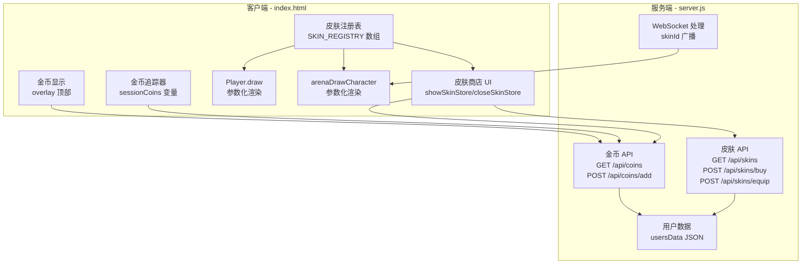

# 设计文档：角色皮肤系统

## 概述

角色皮肤系统为跳跳游戏添加角色外观自定义功能。玩家在经典模式中通过跳跃获得金币，在皮肤商店中购买和装备不同外观的皮肤，皮肤效果在经典模式和竞技模式中统一生效。

系统涉及三个核心层面：
- **客户端渲染层**：改造 `Player.draw()` 和 `arenaDrawCharacter()` 以支持皮肤参数化绘制
- **客户端 UI 层**：皮肤商店界面、金币显示、游戏结束金币结算
- **服务端数据层**：新增金币和皮肤相关 API，扩展 `usersData` 数据结构

所有代码变更集中在 `index.html`（客户端）和 `server.js`（服务端）两个文件中，保持现有单文件架构不变。

## 架构

### 整体架构图



### 设计决策

1. **皮肤定义为纯数据对象**：每个皮肤是一个包含颜色、样式参数的 JS 对象，渲染函数根据参数绘制，无需为每种皮肤编写独立绘制逻辑。这样新增皮肤只需在数组中添加配置项。

2. **金币按局提交**：经典模式中每次跳跃实时累加本地 `sessionCoins`，游戏结束时一次性调用 `POST /api/coins/add` 提交到服务端。避免每次跳跃都发请求。

3. **竞技模式皮肤通过 WebSocket 同步**：玩家创建/加入房间时携带 `skinId`，服务端存储在玩家对象中并广播给其他玩家。其他玩家的客户端根据收到的 `skinId` 查找本地皮肤注册表进行渲染。

4. **未登录用户使用默认皮肤**：所有渲染路径在找不到皮肤数据时回退到 `"default"` 皮肤，保证向后兼容。

## 组件与接口

### 1. 皮肤注册表（SKIN_REGISTRY）

客户端全局常量数组，定义所有可用皮肤：

```javascript
const SKIN_REGISTRY = [
  {
    skinId: 'default',
    name: '默认',
    price: 0,
    bodyColor: '#fff',       // 主体颜色（当前由 roster 颜色决定，default 保持原逻辑）
    innerColor: 'rgba(255,255,255,0.6)', // 内圈颜色
    eyeColor: '#1a1a2e',     // 眼睛颜色
    eyeSize: 2.5,            // 眼睛半径
    highlightColor: '#fff',  // 高光颜色
    outlineColor: null,      // 轮廓颜色（null 表示无轮廓）
    effect: null              // 特效类型（null/'sparkle'/'flame'/'trail'）
  },
  // ... 更多皮肤
];
```

辅助函数：
- `getSkinById(skinId)` → 返回皮肤对象，找不到时返回默认皮肤
- `getEquippedSkin()` → 返回当前装备的皮肤对象（从 localStorage 或全局变量读取）

### 2. 角色渲染器改造

**Player.draw(ox, oy)** 改造：
- 新增参数或从全局状态读取当前皮肤
- 用皮肤参数替换硬编码的颜色值（`bodyColor` 替代 `charColor`，`innerColor` 替代 `rgba(255,255,255,0.6)` 等）
- `default` 皮肤的 `bodyColor` 为 `null` 时，沿用原有的 `roster.getCurrent().color` 逻辑
- 绘制完成后，如果皮肤有 `effect`，调用对应特效绘制函数

**arenaDrawCharacter(px, py, color, skinId)** 改造：
- 新增 `skinId` 参数
- 根据 `skinId` 查找皮肤注册表获取绘制参数
- 本地玩家使用自己装备的皮肤，其他玩家使用 WebSocket 广播的 `skinId`

### 3. 金币系统

**客户端**：
- `sessionCoins` 变量：当局累计金币数
- `pointsToCoins(points)` 函数：50→5, 20→2, 10→1 的映射
- 游戏结束时显示本局金币，并调用 API 提交
- 主界面 overlay 显示金币余额（从服务端获取）

**服务端 API**：

| 接口 | 方法 | 参数 | 返回 |
|------|------|------|------|
| `/api/coins` | GET | query: username, token | `{ coins: number }` |
| `/api/coins/add` | POST | body: { username, token, amount } | `{ ok: true, coins: number }` |

### 4. 皮肤商店 API

| 接口 | 方法 | 参数 | 返回 |
|------|------|------|------|
| `/api/skins` | GET | query: username, token | `{ unlockedSkins: string[], equippedSkin: string }` |
| `/api/skins/buy` | POST | body: { username, token, skinId } | `{ ok: true, coins: number, unlockedSkins: string[] }` |
| `/api/skins/equip` | POST | body: { username, token, skinId } | `{ ok: true, equippedSkin: string }` |

### 5. 皮肤商店 UI

- `showSkinStore()` 函数：替换 overlay 内容为皮肤商店界面
- 顶部显示金币余额
- 网格布局展示皮肤卡片（每个卡片包含 Canvas 预览、名称、价格、状态）
- 每个皮肤卡片内嵌一个小 Canvas 用于预览角色外观
- 点击卡片根据状态执行购买或装备操作
- `closeSkinStore()` 函数：返回主界面

### 6. WebSocket 皮肤同步

- 客户端在发送 `create_room` / `join_room` 消息时附加 `skinId` 字段
- 服务端 `createServerPlayer` 存储 `skinId`
- `getPlayerInfoList` 返回数据中包含 `skinId`
- 客户端竞技模式渲染时，从玩家信息中读取 `skinId` 传给 `arenaDrawCharacter`

## 数据模型

### 皮肤定义对象（客户端）

```javascript
{
  skinId: string,          // 唯一标识符，如 'default', 'flame', 'ocean'
  name: string,            // 显示名称，如 '默认', '烈焰', '海洋'
  price: number,           // 价格（金币），0 表示免费
  bodyColor: string|null,  // 主体颜色，null 表示使用角色原色
  innerColor: string,      // 内圈颜色
  eyeColor: string,        // 眼睛颜色
  eyeSize: number,         // 眼睛半径
  highlightColor: string,  // 高光颜色
  outlineColor: string|null, // 轮廓描边颜色
  effect: string|null      // 特效类型：null/'sparkle'/'flame'/'trail'/'glow'/'rainbow'
}
```

### 用户数据扩展（服务端 usersData）

现有结构：
```javascript
usersData[username] = {
  password: string,
  token: string,
  createdAt: number
}
```

扩展后：
```javascript
usersData[username] = {
  password: string,
  token: string,
  createdAt: number,
  coins: number,              // 金币余额，默认 0
  unlockedSkins: string[],    // 已解锁皮肤 ID 列表，默认 ['default']
  equippedSkin: string        // 当前装备皮肤 ID，默认 'default'
}
```

### 竞技模式玩家对象扩展（服务端）

现有 `createServerPlayer` 返回对象新增：
```javascript
{
  // ... 现有字段
  skinId: string  // 玩家装备的皮肤 ID
}
```

### 客户端状态

```javascript
// 全局变量
let playerCoins = 0;           // 从服务端同步的金币余额
let playerUnlockedSkins = ['default'];  // 已解锁皮肤列表
let playerEquippedSkin = 'default';     // 当前装备皮肤 ID
let sessionCoins = 0;          // 当局累计金币（经典模式）
```


## 正确性属性

*属性是一种在系统所有有效执行中都应成立的特征或行为——本质上是关于系统应该做什么的形式化陈述。属性是人类可读规范与机器可验证正确性保证之间的桥梁。*

### 属性 1：皮肤注册表完整性

*对于任意* 皮肤注册表 SKIN_REGISTRY，其中每个皮肤对象都应包含 skinId、name、price、bodyColor、innerColor、eyeColor、eyeSize、highlightColor 字段，且所有 skinId 值互不相同，注册表长度不少于 6。

**验证需求：1.1**

### 属性 2：评分到金币的映射正确性

*对于任意* 有效的跳跃评分值（50、20、10），`pointsToCoins` 函数应返回对应的金币数量（5、2、1），且对于任意非有效评分值（如 0 或负数），应返回 0。

**验证需求：2.1**

### 属性 3：金币余额累加往返

*对于任意* 已注册用户和任意正整数金币数量序列，依次调用 `POST /api/coins/add` 后，调用 `GET /api/coins` 返回的余额应等于所有添加金额之和加上初始余额。

**验证需求：2.2, 3.1, 3.2**

### 属性 4：认证令牌验证

*对于任意* 需要认证的 API 端点（/api/coins, /api/coins/add, /api/skins, /api/skins/buy, /api/skins/equip），当请求携带无效 token 时，应返回 401 状态码。

**验证需求：3.4**

### 属性 5：皮肤购买正确性

*对于任意* 用户金币余额和任意未解锁皮肤，调用 `POST /api/skins/buy` 后：若余额 ≥ 皮肤价格，则购买成功，余额减少恰好等于皮肤价格，且该皮肤出现在已解锁列表中；若余额 < 皮肤价格，则购买失败，余额不变，已解锁列表不变。

**验证需求：4.1, 4.2, 4.3, 4.5**

### 属性 6：皮肤装备正确性

*对于任意* 用户和任意皮肤 skinId，调用 `POST /api/skins/equip` 后：若该皮肤在用户已解锁列表中，则装备成功，`GET /api/skins` 返回的 equippedSkin 等于该 skinId；若该皮肤不在已解锁列表中，则装备失败，equippedSkin 不变。

**验证需求：5.1, 5.4**

### 属性 7：皮肤操作按钮状态判定

*对于任意* 皮肤和用户状态组合（未解锁/已解锁/已装备），判定函数应返回正确的操作类型：未解锁 → 'buy'，已解锁但未装备 → 'equip'，已装备 → 'equipped'。

**验证需求：6.3**

### 属性 8：默认皮肤回退

*对于任意* 无效的 skinId（包括 null、undefined、空字符串、不存在的 ID），`getSkinById` 函数应返回 skinId 为 'default' 的皮肤对象。

**验证需求：7.4**

## 错误处理

### 客户端错误处理

| 场景 | 处理方式 |
|------|----------|
| 未登录时尝试购买/装备 | 提示"请先登录"，不发送请求 |
| 网络请求失败 | 显示"网络错误，请重试"，不改变本地状态 |
| API 返回 401 | 清除本地登录状态，提示重新登录 |
| API 返回 400（金币不足） | 显示"金币不足"提示，不改变 UI 状态 |
| API 返回 400（皮肤已解锁） | 刷新本地状态（可能是数据不同步） |
| 皮肤注册表中找不到 skinId | 回退使用 default 皮肤 |
| 竞技模式收到未知 skinId | 使用 default 皮肤渲染该玩家 |

### 服务端错误处理

| 场景 | HTTP 状态码 | 响应 |
|------|------------|------|
| 缺少必要参数 | 400 | `{ error: '请求格式错误' }` |
| token 验证失败 | 401 | `{ error: '未登录或登录已过期' }` |
| 金币不足 | 400 | `{ error: '金币不足' }` |
| 皮肤已解锁 | 400 | `{ error: '皮肤已解锁' }` |
| 皮肤未解锁（装备时） | 400 | `{ error: '皮肤未解锁' }` |
| 皮肤 ID 不存在 | 400 | `{ error: '皮肤不存在' }` |
| 用户数据缺少 coins/skins 字段 | 自动初始化默认值 | 正常响应 |

### 数据迁移兼容

对于已有用户（usersData 中没有 coins/unlockedSkins/equippedSkin 字段），API 在首次访问时自动初始化：
- `coins` → 0
- `unlockedSkins` → `['default']`
- `equippedSkin` → `'default'`

## 测试策略

### 双重测试方法

本功能采用单元测试 + 属性测试的双重策略，确保全面覆盖。

### 属性测试（Property-Based Testing）

使用 **fast-check** 库进行属性测试，每个属性测试至少运行 100 次迭代。

每个属性测试必须用注释标注对应的设计属性：
```javascript
// Feature: character-skins, Property 1: 皮肤注册表完整性
```

属性测试覆盖：

| 属性 | 测试内容 | 生成器 |
|------|----------|--------|
| 属性 1 | 验证 SKIN_REGISTRY 结构完整性和唯一性 | 遍历注册表 |
| 属性 2 | pointsToCoins 映射正确性 | 生成随机整数，包含有效值和无效值 |
| 属性 3 | 金币累加往返 | 生成随机正整数数组作为金币序列 |
| 属性 4 | 无效 token 被拒绝 | 生成随机字符串作为 token |
| 属性 5 | 购买逻辑正确性 | 生成随机余额和随机皮肤价格 |
| 属性 6 | 装备逻辑正确性 | 生成随机已解锁皮肤列表和随机 skinId |
| 属性 7 | 操作按钮状态判定 | 生成随机皮肤状态组合 |
| 属性 8 | 默认皮肤回退 | 生成随机无效 skinId（null/undefined/随机字符串） |

每个正确性属性由一个属性测试实现。

### 单元测试

单元测试聚焦于具体示例和边缘情况：

- 默认皮肤存在且价格为 0（需求 1.2）
- 未登录用户不授予金币（需求 2.4）
- 购买已解锁皮肤返回错误（需求 4.4）
- 装备未解锁皮肤返回错误（需求 5.3）
- WebSocket 消息包含 skinId（需求 8.5）
- 用户数据缺少新字段时自动初始化

### 测试文件组织

```
tests/
  skin-registry.test.js    — 属性 1, 2, 8 + 相关单元测试
  coin-api.test.js         — 属性 3, 4 + 金币相关单元测试
  skin-api.test.js         — 属性 5, 6 + 皮肤购买/装备单元测试
  skin-store-logic.test.js — 属性 7 + UI 逻辑单元测试
```
