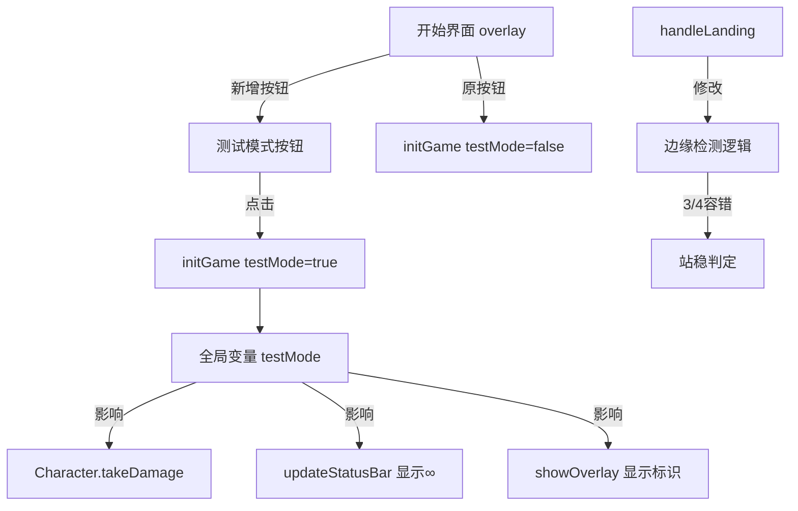

# Design Document: 跳跳游戏增强功能

## Overview

本设计为跳跳游戏（`jump_game/跳跳蛙.html`）新增两个功能：

1. **测试模式**：在开始界面增加"测试模式"按钮，进入后角色拥有无限血量，状态栏显示 ∞ 符号，失败不扣血，游戏结束界面显示"[测试模式]"标识。
2. **边缘落地容错**：将脚部检测从"4个点全部在平台内"放宽为"4个点中3个在平台内即可站稳"，减少因微小偏差触发滑落的情况。

所有改动均在单个 HTML 文件 `jump_game/跳跳蛙.html` 内完成，不引入新文件。

## Architecture

当前游戏为单文件架构，所有逻辑（渲染、物理、状态管理）均在一个 `<script>` 标签内。本次改动遵循同样的架构风格，通过新增全局状态变量和修改现有函数来实现。

### 改动范围



### 关键设计决策

1. **全局布尔变量 `testMode`**：用一个全局变量控制模式，而非修改 Character 类。原因是测试模式是游戏级别的概念，不是角色级别的属性。
2. **修改 `takeDamage` 行为而非跳过调用**：在 `takeDamage` 内部检查 `testMode`，而非在每个调用点做判断。这样更集中、不易遗漏。
3. **容错阈值硬编码为 3/4**：需求明确指定 3/4，无需做成可配置参数。

## Components and Interfaces

### 新增全局变量

| 变量 | 类型 | 默认值 | 说明 |
|------|------|--------|------|
| `testMode` | `boolean` | `false` | 当前是否为测试模式 |

### 修改的函数/方法

| 函数 | 修改内容 |
|------|----------|
| `Character.takeDamage()` | 测试模式下跳过扣血逻辑 |
| `initGame()` | 接受 `isTestMode` 参数，设置全局 `testMode` |
| `updateStatusBar()` | 测试模式下显示 `∞` 替代心形图标 |
| `showOverlay(isGameOver)` | 测试模式下游戏结束界面显示 `[测试模式]` 标识 |
| `handleLanding()` | 边缘检测从 `every` 改为计数判断（≥3 即站稳） |

### 新增 DOM 元素

| 元素 | 位置 | 说明 |
|------|------|------|
| `#testModeBtn` | overlay 内，`#startBtn` 下方 | "测试模式"按钮，样式与开始按钮区分 |

### 按钮样式区分

"测试模式"按钮使用不同的背景色（如 `#0f3460` 深蓝色）和较小的字号，与红色的"开始游戏"按钮形成视觉区分。

## Data Models

### 游戏状态变化

```
现有状态:
  gameRunning: boolean
  roster: CharacterRoster
  Character.health: number (0-5)
  Character.alive: boolean

新增状态:
  testMode: boolean  // 游戏级别，非角色级别
```

### Character.takeDamage 行为矩阵

| 模式 | 调用 takeDamage | health 变化 | alive 变化 |
|------|----------------|-------------|------------|
| Normal | 是 | health - 1 | health === 0 时 false |
| Test | 是 | 不变 | 始终 true |

### 边缘检测判定矩阵

| 通过 hitTest 的脚部点数 | 当前行为 | 新行为 |
|------------------------|----------|--------|
| 4/4 | 站稳 | 站稳 |
| 3/4 | 滑落 | **站稳**（改动点） |
| 2/4 | 滑落 | 滑落 |
| 1/4 | 滑落 | 滑落 |
| 0/4 | 滑落 | 滑落 |


## Correctness Properties

*A property is a characteristic or behavior that should hold true across all valid executions of a system — essentially, a formal statement about what the system should do. Properties serve as the bridge between human-readable specifications and machine-verifiable correctness guarantees.*

### Property 1: Test mode damage immunity

*For any* Character in test mode, and *for any* number of `takeDamage` calls (1 to N), the character's `health` should remain unchanged from its initial value and `alive` should remain `true`.

**Validates: Requirements 2.1, 2.3**

### Property 2: Normal mode damage mechanics

*For any* Character in normal mode with initial health H (where H > 0), calling `takeDamage` once should result in health equal to H - 1, and `alive` should be `false` if and only if the resulting health is 0.

**Validates: Requirements 2.4**

### Property 3: Edge landing tolerance threshold

*For any* platform and *for any* landing position, the character should be judged as stable (no edge slip) if and only if 3 or more of the 4 foot points pass the platform's `hitTest`. Conversely, if 2 or fewer foot points pass, edge slip should be triggered.

**Validates: Requirements 3.1, 3.2, 3.3**

## Error Handling

| 场景 | 处理方式 |
|------|----------|
| `testMode` 未初始化 | `initGame` 中默认设为 `false`，确保正常模式为默认行为 |
| 测试模式下所有角色"死亡" | 由于 `takeDamage` 不生效，`allEliminated()` 永远返回 `false`，游戏不会因血量耗尽结束。玩家需手动刷新退出 |
| 边缘检测中 `hitTest` 异常 | `hitTest` 为纯几何计算，不涉及外部依赖，无需额外错误处理 |
| 游戏结束界面模式标识 | 通过检查 `testMode` 变量决定是否显示，变量为布尔值，不存在中间状态 |

## Testing Strategy

### 测试框架

- **单元测试 & 属性测试**：使用 [fast-check](https://github.com/dubzzz/fast-check) 作为属性测试库，配合 Jest 或 Vitest 运行
- 由于游戏为单文件 HTML，测试需要提取核心纯函数进行测试，或在测试中模拟相关类和函数

### 属性测试（Property-Based Tests）

每个属性测试至少运行 100 次迭代。

| 属性 | 测试描述 | 标签 |
|------|----------|------|
| Property 1 | 生成随机 takeDamage 调用次数（1-100），在 testMode=true 下验证 health 不变、alive 为 true | Feature: jump-game-enhancements, Property 1: Test mode damage immunity |
| Property 2 | 生成随机初始 health（1-5）和随机 takeDamage 调用次数，在 testMode=false 下验证 health 递减和 alive 状态 | Feature: jump-game-enhancements, Property 2: Normal mode damage mechanics |
| Property 3 | 生成随机平台（形状、大小）和随机落点位置，计算 4 个脚部点的 hitTest 结果，验证站稳判定与 ≥3 阈值一致 | Feature: jump-game-enhancements, Property 3: Edge landing tolerance threshold |

### 单元测试（Unit Tests）

| 测试 | 验证内容 |
|------|----------|
| 测试模式按钮存在 | overlay 中包含标签为"测试模式"的按钮（Req 1.1） |
| 按钮样式区分 | 两个按钮的 background-color 不同（Req 1.2） |
| 点击测试模式按钮 | 点击后 testMode=true，overlay 隐藏（Req 1.3） |
| 点击开始游戏按钮 | 点击后 testMode=false，overlay 隐藏（Req 1.4） |
| 状态栏显示 ∞ | testMode=true 时状态栏包含 ∞ 而非 ❤️（Req 2.2） |
| 脚部检测点不变 | 4 个点的坐标为 [x-8,y], [x+8,y], [x,y-4.8], [x,y+4.8]（Req 3.4） |
| 游戏结束界面测试模式标识 | testMode=true 时显示"[测试模式]"（Req 4.1） |
| 游戏结束界面正常模式无标识 | testMode=false 时不显示模式标识（Req 4.2） |
